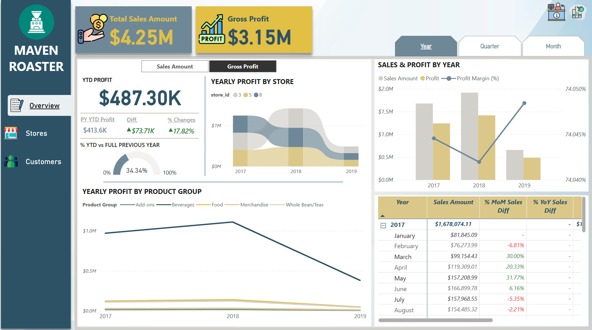
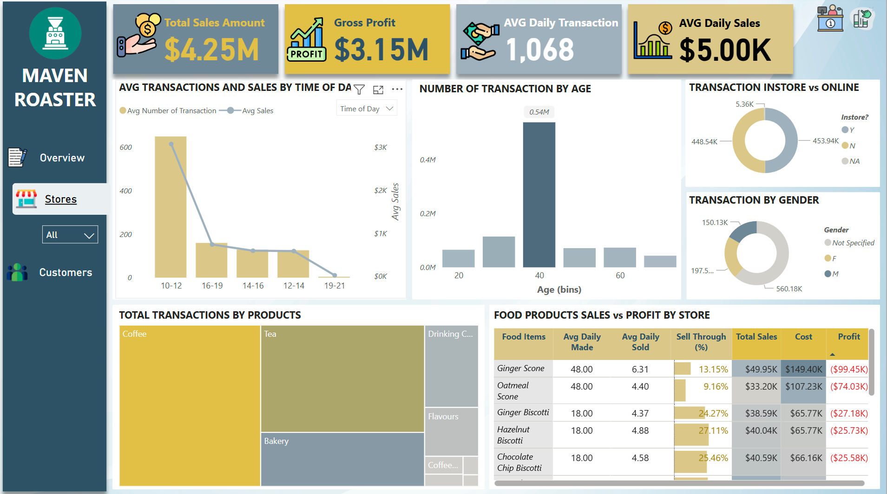
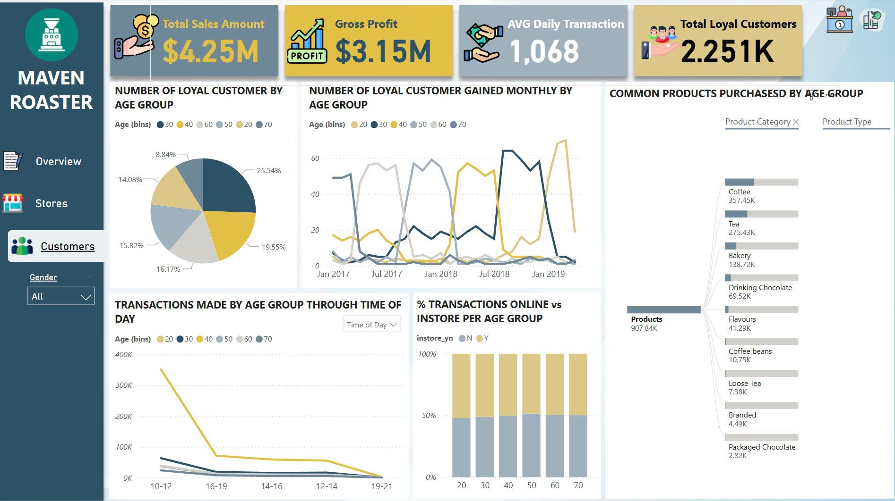
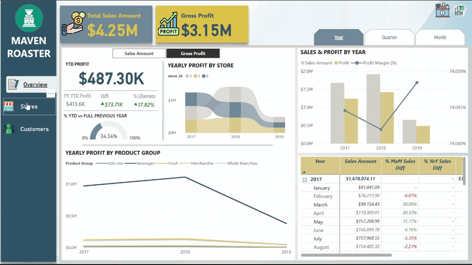

# ☕ Maven Roasters Sales Dashboard — Power BI Project

## 📊 Project Overview

This Power BI report analyzes sales data from Maven Roasters, a specialty coffee company. The purpose of the report is to track sales performance, understand customer behavior, and optimize product and regional strategies. It is part of my personal portfolio to showcase skills in data analytics and Power BI storytelling.

## 💡 Objectives

- Track key sales performance indicators across time.
- Identify best- and worst-performing products and categories in each store.
- Analyze customer segments and their purchasing behaviors.
- Provide actionable insights using clear and interactive visuals.

## 🔧 Tools & Skills Used

- **Power BI Desktop**: Data modeling and dashboard creation.
- **Power Query Editor**: Data transformation and cleaning.
- **DAX (Data Analysis Expressions)**: Measures for KPIs and calculated fields.
- **Data Modeling**: Structured relationships between customer, order, and product tables.
- **Interactive Visualization**: KPI cards, charts, slicers, and maps.

## 📌 Key Highlights

- 📈 **Sales KPIs**: Revenue and profit margin visualized over time.
- 🏆 **Store Performance**: Store sales perfomance breakdown.
- 👥 **Customer Analysis**: Customers's purchase behavior by age group.
- 🎛 **User Controls**: Slicers to filter by product category, customer type, date range, and more.

## 📁 Project Structure

- `Maven Roaster - Report.pbix`: Power BI report file with all visuals, data model, and measures.
- `Sales by Store.csv`: Dataset contains transactions including date, store, employee, quantity sold, price, etc.
- `Food Inventory.csv`: Dataset contains details about daily pastry stock level, quantity used and waste.
- `Customer Lookup.csv`: Dataset contains customer ID, home store, name, email, loyalty details, birthdate, gender.
- `Employee Lookup.csv`: Dataset contains details of staff member including their name, position, location and start date.
- `Product Lookup.csv`: Dataset contains details for each product like type, group, category, unit of measure, wholesale price, retail price, tax exempt, discount and new product.
- `Store Lookup.csv`: Dataset contains details for each store location, address, phone number and store type

## 📷 Screenshots

- **Overview page**
  

- **Stores page**
  

- **Customers page**
  

- **Navigation Panel**
  

- **Dynamic Filters**
  

## 🧠 What I Learned

- Applying clean data modeling principles for business reporting.
- Designing user-friendly report for non-technical users.
- Creating dynamic metrics using DAX.
- Enhancing storytelling with layout, color, and filter design.

  

📫 **Let’s Connect**  
This project is a personal learning exercise and part of my data portfolio. Feel free to explore or reach out for collaboration or feedback!

